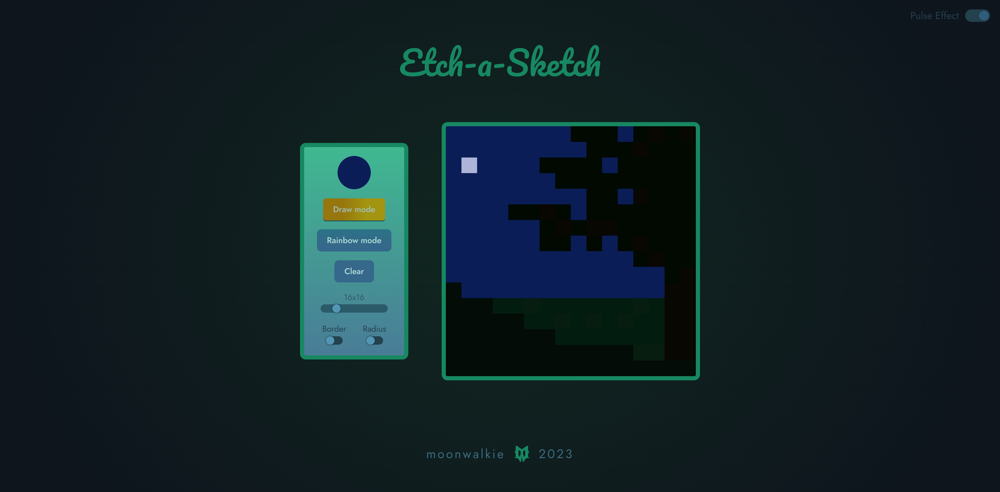

# Etch-a-Sketch

Live site: https://moonwalkie.github.io/etch-a-sketch/

## Overview

Show the artist in you! Play etch-a-sketch on the web and express your drawing skills with a functional, modern, and visually pleasing little tool created by me.

## Features

 - drawing mode with the ability to choose any color
 - rainbow mode which randomizes colors as you draw
 - clear board button
 - slider to choose grid size between 4x4 and 64x64
 - border and radius toggle for the cells
 - pulsating background effect which can be turned on or off
 - responsive design